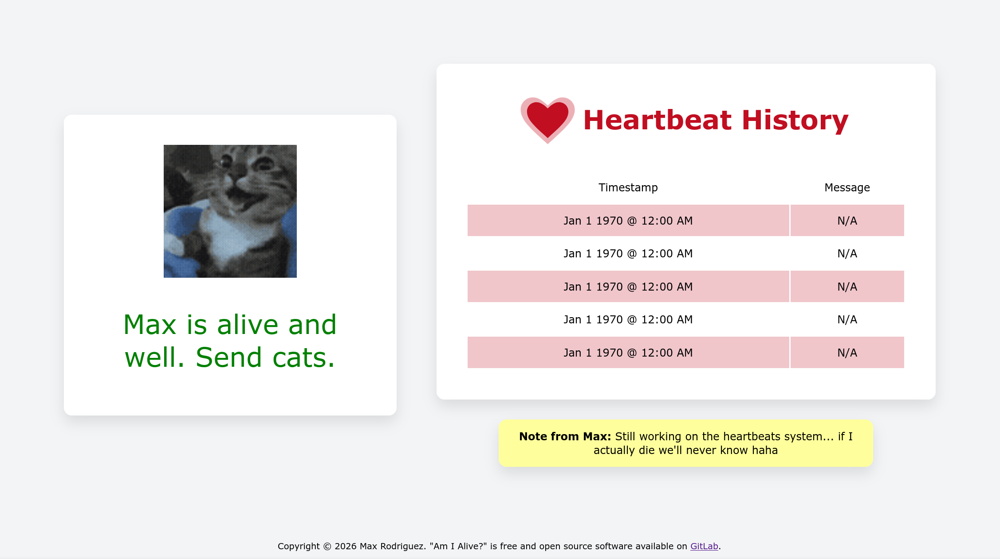

# Am I Alive

## Notes for implementation:

Heartbeat URL: status.maxrdz.com/heartbeat

Must enter:

- Passkey
- Message (optional)

Passkey MUST be very long but engraved in my brain.

Store passkey as a hash on the server!

Use argon2id?

Rate limit by IP address. One failed attempt = 5 minute delay. x2 per failed attempt. Exponential protection.

Intense protection: On >100 failed auths across many IPs (brute force detected), start banning IPs (maybe?).

Require PoW challenge to make every request computationally expensive to further mitigate bruteforce.

