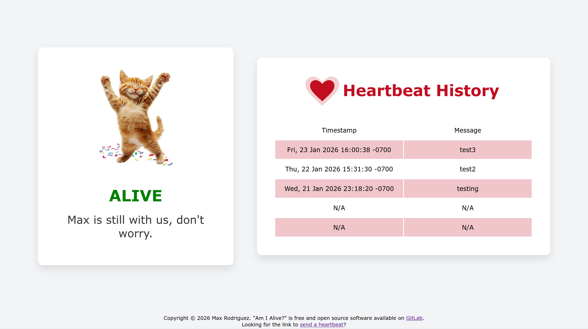
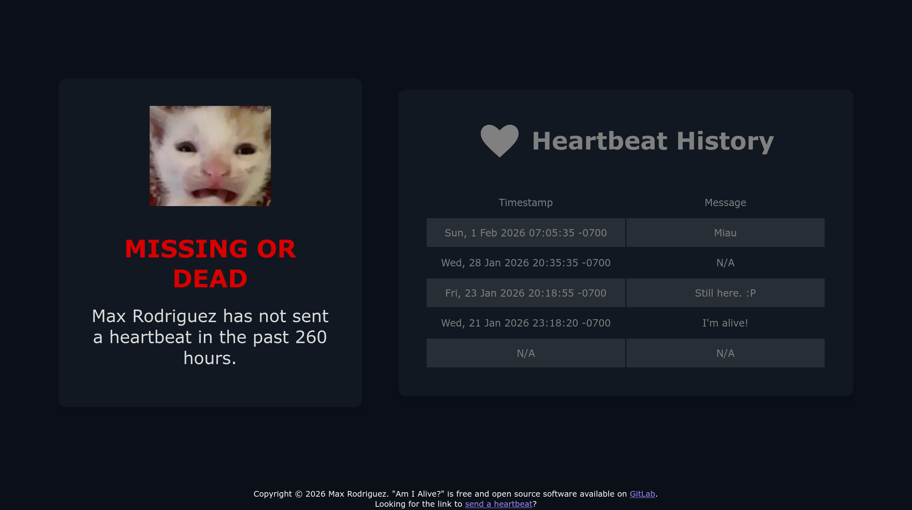
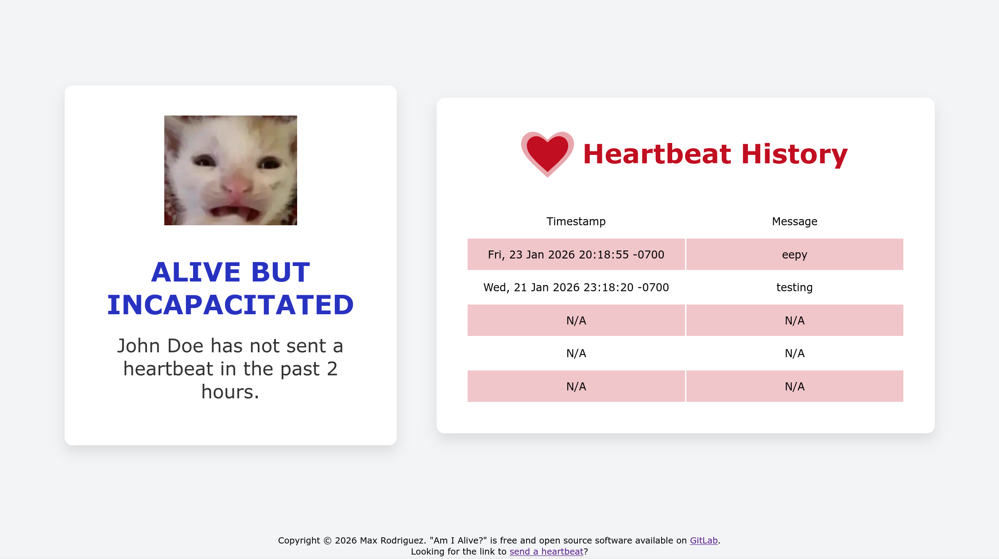
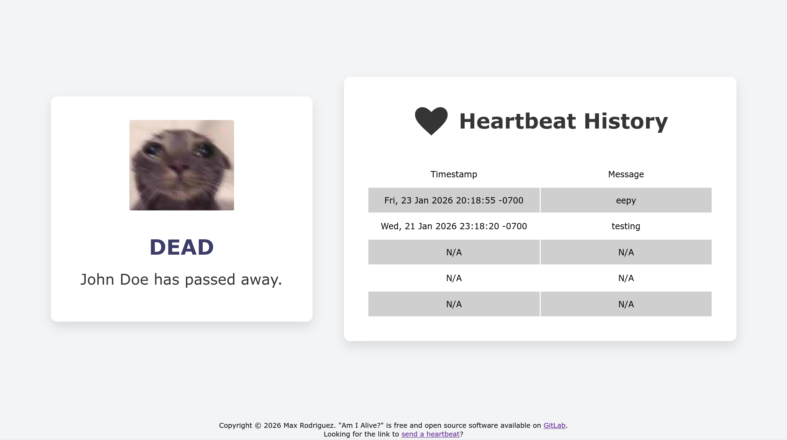

# Am I Alive

A dynamic website, built with Rust, that can be used to let your online
friends know you're still alive. Think about it like your digital tombstone.
This program acts like a **dead man's switch**, except there is no bomb, but instead
a (yet to be implemented) autonomous **digital will** that releases once your death is
confirmed by the program.



### **Check out a live example on my personal website: [status.maxrdz.com](https://status.maxrdz.com)!**

# Building from Source

In this Git local repository directory, run:
```sh
$ docker build -t amialived .
```

# Getting Started

1. Create the DB file and configuration file.

    ```sh
    $ cp example-db.txt db.txt
    $ cp example.toml config.toml
    ```

2. Configure the application to your needs. The following values are basic/essential
    to configure before running your copy of "Am I Alive?" for the first time:

    - `name`: Your first name, or nickname.

    - `full_name`: Your first and last name. What you go by formally. This name is
      used whenever the application believes you may not be alive.

    - `heartbeat_auth_hash`: The Argon2id hash of your password to authenticate.
      Generate your hash for your password using https://argon2.online/. (**NOTE:**
      Keep the default hash parameters.)

    - `secret`: The 256-bit cryptographically secure random string, used to create
      PoW (Proof of Work) challenges that are unpredictable. Generate your secret
      with OpenSSL by using the following command:

      ```sh
      $ openssl rand -hex 32
      ```

    Feel free to tweak the other configuration values, such as the UTC time offset
    (timezone) used when displaying heartbeat timestamps, the pictures you would
    like to be shown depending on what state the application is in, etc.

3. Finally, run the daemon + the front-facing NGINX instance using Docker compose:

    ```sh
    $ docker-compose up
    ```

# How does it work?

*How does it know you died?* Well, it's called a dead man's switch for a reason: It
does not trigger for as long as you hold it. In this case, 'holding' the switch is
sending in a **heartbeat** everyday. This tells the program that you are still with us.

There is a configurable '**grace period**' which is the maximum period of time you can go
without sending a heartbeat and being considered **100% alive**. If you do not send a
heartbeat in the 'grace period', the program will now display "**Probably Alive.**" Then
there is a **maximum silence period**. This is the maximum period of time you can go
without sending a heartbeat and not being declared "**dead or missing**" by the program.

> Note: The following portion is yet to be implemented.

Once declared "Dead or Missing", the program will send out automated emails to 1 or more
**trusted users**. These are e-mail addresses that were configured by the alive-you. The
program sends the same e-mail to all trusted users saying it now believes you are dead,
and requires confirmation from **all trusted users** in order to come to a final verdict.

The trusted user(s) are given the following options: Missing, Incapacitated, or Dead.

- If "Missing" is chosen, the program remains in the "Missing or Dead" state.
  Your digital will does not go into action.

  

- If "Incapacitated" is chosen, the program enters the "Alive, but Incapacitated" state.
  This option should be chosen when you are in an unconscious/unresponsive state, and
  there is hope of you coming back. Your digital will does not go into action.

  

- If "Dead" is chosen, the program enters the final state which turns the website into
  a memorial. **It is only at this state where your digital will goes into action.**

  

**ALL trusted users must give the same answer in order for the program to accept it.**
If any response differs from the rest, another e-mail will be sent to all trusted users.
This keeps going until all trusted users have agreed on your state, or you sent a new
heartbeat. (*Either you were found, woke up from a coma, or came back from the dead.*)

# Is it secure?

Yes. (Trust) I am a very paranoid person. First of all, the worst they can do is keep
you alive. (and.. update your note, i guess) Though, that is close to impossible
**if you chose a strong password**.

- Your password is stored on the server as an Argon2Id hash. Even if a bad actor
  manages to get access to your server, it would still be close to impossible for them
  to crack your password.

- The server enforces strict rate limiting on failed attempts. This includes you. On
  one failed attempt, you are blocked for 5 minutes. On each next failed attempt, the
  wait time to try again increases exponentially. (5 mins, 10 mins, 20 mins ...) Rate
  limiting is enforced **per IP address**. (Don't worry, this is not the same as
  getting your account locked. Bad actors cannot get you locked out on your behalf,
  unless you are accessing your website under their IP address.) **If your copy of
  "Am I Alive?" is behind a proxy, please MAKE SURE that IP addresses are also relayed
  through the proxy and to the actual `amialived` process.**

- Each request to send an authenticated heartbeat must go through a **PoW (Proof of work)**
  challenge. This is a cryptographic challenge that the requesting client must complete
  before sending their request. This adds a computational cost to bad actors who are
  trying to bruteforce your password. The server already enforces rate limiting, but
  this is a way of ensuring bruteforcing remains unfeasible, even if rate limiting is
  somehow bypassed. This also helps against (D)DoS attacks. Verifying the proof of work
  on the server's end is very cheap. It only has to calculate a SHA256 hash and check
  that the target has been met.

- We store sensitive data (such as the current state, the last heartbeat timestamp,
  etc.) in memory with a total of **3 copies** of the data. This way, if an insanely
  rare event happens that leads to data corruption in your server's memory (like a
  cosmic ray flipping a bit) the program will detect the corruption and panic before
  it continues. I expect you are running the server in a container that is set to
  restart itself when it crashes.

- The server is written in Rust, a language designed with memory safety in mind. Many
  common software vulnerabilities (such as buffer overflows) are eliminated by Rust’s
  ownership model and type system, which enforce valid states at compile time and make
  many invalid states unrepresentable.

## End-User (Sysadmin) Expectations

- Use a **strong password**.
- Generate your PoW secret using `openssl rand -hex 32`, or any other
  **cryptographically secure source**.
- Expose the application with your front-end HTTP server (can be the NGINX instance
  deployed by "Am I Alive?", or your own HTTP reverse proxy) configured with **a valid
  SSL certificate for encryption** when sending sensitive credentials.

  **If your copy of "Am I Alive?" is running behind an HTTP reverse proxy:**

- The reverse proxy must securely encrypt HTTP requests using a valid SSL certificate.
- Security within your server's internal network to prevent attackers from setting
  up their own reverse proxy to communicate directly with the "Am I Alive?" application
  and spoof their requests' source IP (aka 'real IP') to bypass rate limiting by IP
  address. Rate limiting by Proof of Work will still be enforced here.

# Legal

Copyright © 2026 Max Rodriguez

"Am I Alive?" can be found at https://gitlab.com/maxrdz/am-i-alive

"Am I Alive?" is distributed under the terms of the GNU Affero General Public
License, either version 3.0 or, at your option, any later
version WITHOUT ANY WARRANTY. You can read the full copy of
the software license in the COPYING file.
